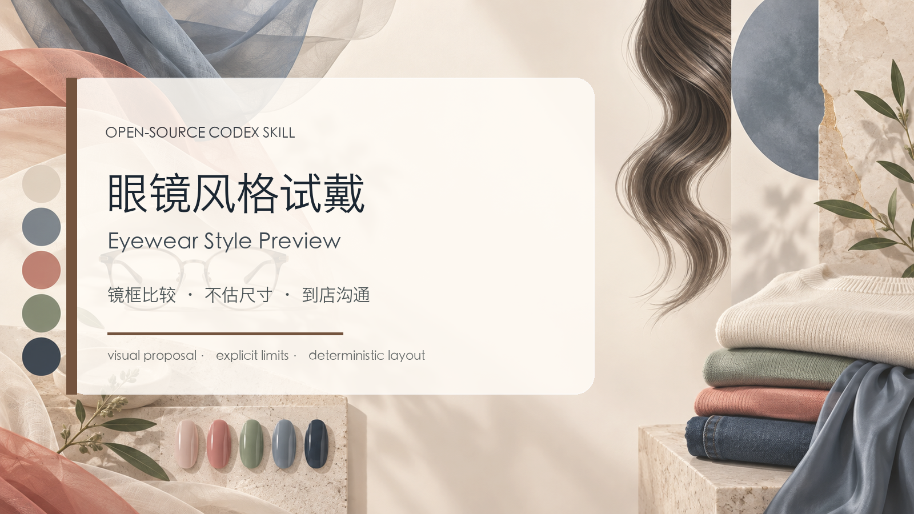

# Eyewear Style Preview



眼镜风格试戴 Skill：把授权人像转成一张 4:3 的镜框风格比较报告。

## 使用方法

```text
使用 $eyewear-style-preview，为我比较通勤用的轻量金属框、透明框和深色板材框。
原图已经戴眼镜；不要伪造摘镜原图，也不要估算毫米尺寸。
```

输出是 AI 模拟试戴，不是处方、尺寸或舒适度结论。到店前仍需实物试戴。
