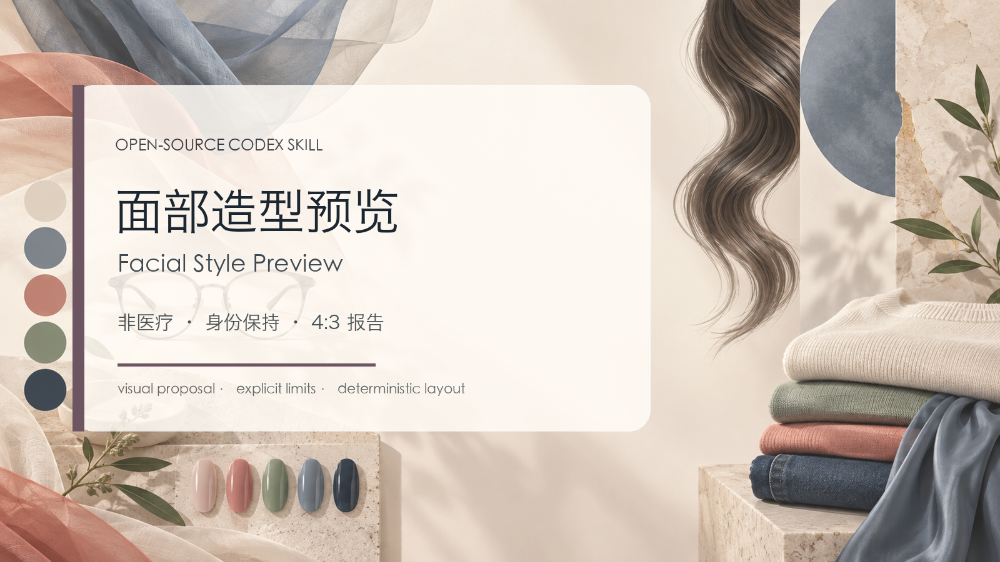

# Facial Style Preview



面部造型预览 Skill：将授权人像转成非医疗、身份保持的 4:3 造型模拟报告。

## 使用方法

```text
使用 $facial-style-preview，把这张已授权人像做成自然妆、眉形整理和唇色的六区域对照。
保留痣、年龄感、脸型和表情；Before 不要丑化，After 必须标注为造型模拟。
```

只允许妆容、修眉、颜色、光影等非侵入式视觉变化；不要要求它根据照片推荐注射、手术或治疗。
