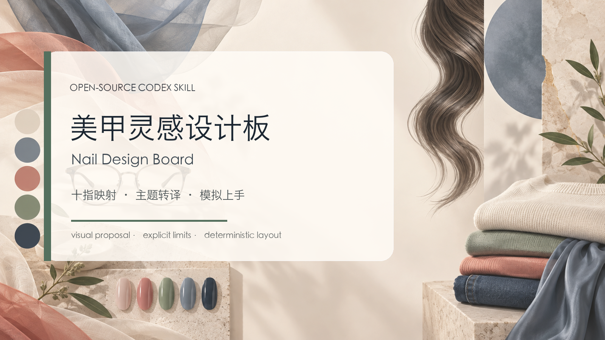

# Nail Design Board



美甲灵感设计板 Skill：把主题或灵感图转译为 L1–L5、R1–R5 的完整十指方案和横向 4:3 提案图。

## 使用方法

```text
使用 $nail-design-board，把“月下银桂”做成十指美甲提案。
没有手部照片，请使用通用成年手模，并标注 AI 模拟上手图。
```

清单必须十指完整、左右不乱；图片好看不等于已制作、可施工或材料性能已验证。
